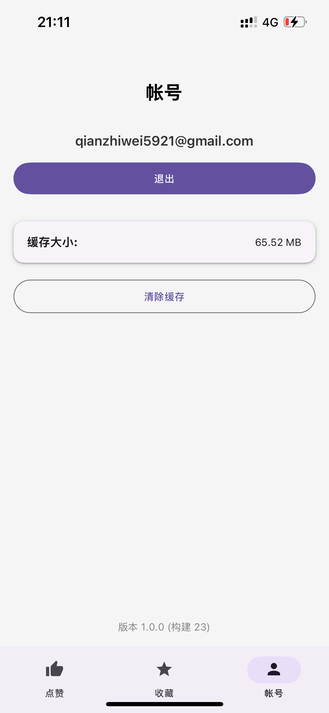

# xhs-video-player

## Downloader 
please visit [https://github.com/qzw881130/xhs-download-videos](https://github.com/qzw881130/xhs-download-videos)

## Demonstration
<table>
  <tr>
    <td></td>
    <td></td>
  </tr>
  <tr>
    <td></td>
    <td></td>
  </tr>
  <tr>
    <td></td>
    <td></td> <!-- 空单元格 -->
  </tr>
</table>

## Installation
1. Create .env in code root

```
####.env
SUPABASE_URL=from xhs-video-player project
SUPABASE_ANON_KEY=from xhs-video-player project
```

2. Run command
```
yarn install
yarn start
yarn run push-env
yarn run package-ios
```


## Make icon/favicon

```
mv Cjdowner-Cryptocurrency-Flat-Canada-eCoin-CDN.1024.png icon-red-leaf.png
magick bc3b84d22bb3fc69f9ad235b8bdfe50d.jpg -resize "1284\!x2778\!" splash_car.png
magick icon-red-leaf.png  -resize "48\!x48\!" favicon.png
```

## Reference

* [Download image](https://www.pinterest.com/pin/625578204504140036/)
* [Supabase](https://supabase.com/)
